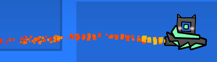
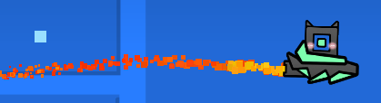

# Smooth Particles
Interpolates particle spawn positions between frames to make the game appear smoother in general

Especially noticeable at higher speeds and/or lower FPS and/or in texture packs with increased particle count

## Examples
### 4x speed ship, 120 FPS
#### Before

#### After

